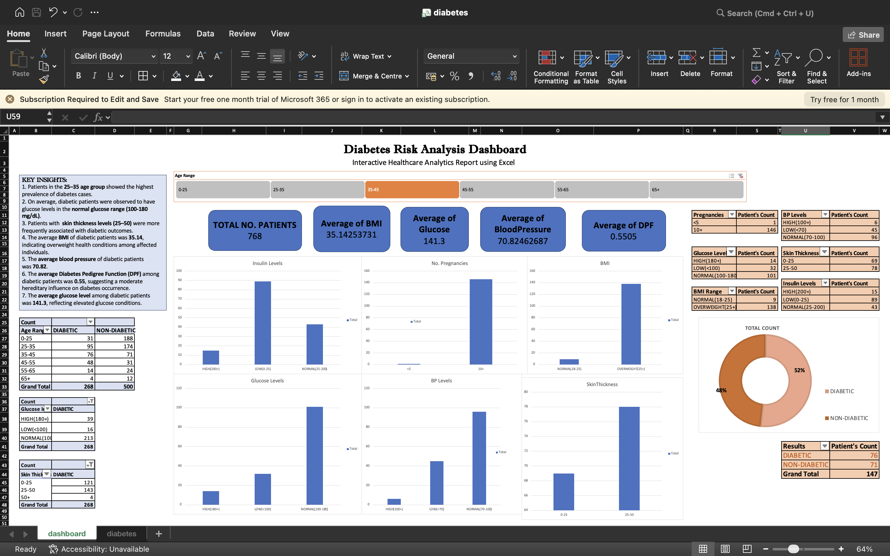

# Diabetes Risk Analysis Dashboard

An interactive Excel healthcare dashboard analyzing 768 patient records to identify which clinical indicators most strongly associate with diabetes.

---

## Problem

Healthcare analysts need a quick way to identify which clinical indicators most strongly correlate with diabetes to help prioritize screening criteria.

---

## Objective

Build an interactive dashboard segmenting diabetic vs. non-diabetic outcomes by age, glucose, BMI, blood pressure, insulin, and skin thickness.

---

## Dashboard Preview

---

## Dataset

Pima Indians Diabetes Database, 768 patient records, originally released by the National Institute of Diabetes and Digestive and Kidney Diseases and widely available via Kaggle/UCI.

| Field | Description |
|---|---|
| Pregnancies | Number of pregnancies |
| Glucose | Plasma glucose concentration |
| BloodPressure | Diastolic blood pressure (mm Hg) |
| SkinThickness | Triceps skin fold thickness (mm) |
| Insulin | 2-hour serum insulin (mu U/ml) |
| BMI | Body mass index |
| DiabetesPedigreeFunction | Diabetes likelihood based on family history |
| Age | Age in years |
| Outcome | 1 = Diabetic, 0 = Non-diabetic |

---

## Process

- Reviewed a largely clean dataset with minimal manual correction needed
- Bucketed continuous variables (Glucose, BMI, Blood Pressure, Insulin, Skin Thickness) into clinical risk categories using PivotTables
- Built PivotCharts comparing diabetic vs. non-diabetic counts across each category
- Added an age-range slicer for interactive filtering
- Built KPI cards for headline statistics (total patients, average BMI/glucose/blood pressure/DPF)
- Added a donut chart for the overall diabetic split and a written insights panel on the dashboard

---

## Key Findings

- The **25–35 age group** shows the highest diabetes prevalence
- Average BMI among diabetic patients: **35.14** (obese range)
- Average glucose among diabetic patients: **141.3 mg/dL**, above normal range
- Average blood pressure: **70.82**; average Diabetes Pedigree Function: **0.55**
- Skin thickness **25–50** shows a stronger association with diabetic outcomes than 0–25

---

## Tools

- Excel — PivotTables, PivotCharts, Slicers, Conditional Formatting

---

## Future Work

- Cross-reference glucose/BMI risk buckets against age to find compound risk profiles
- Build a simple scoring model to flag high-risk patients
